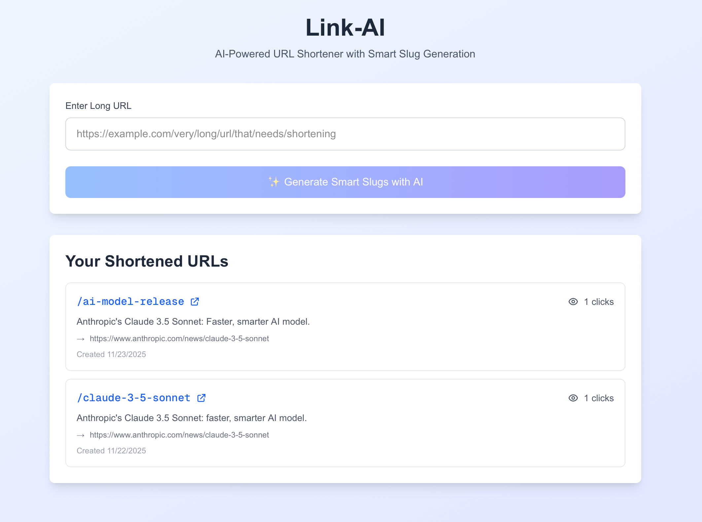

# Link-AI

An AI-powered URL shortener that generates smart, memorable slugs using Google Gemini AI. Features real-time analytics, click tracking, and automatic link descriptions.

## 🚀 Live Demo

**[View Live Application](https://link-ai-kappa.vercel.app/)** 

## ✨ Features

- 🤖 **AI-Powered Slug Generation** - Gemini 2.0 creates contextually relevant, SEO-friendly short URLs
- 🔗 **Custom Short Links** - Choose AI suggestions or create your own custom slugs
- 📊 **Click Analytics** - Real-time tracking of link clicks and engagement
- 📝 **Auto Descriptions** - AI generates helpful descriptions for each shortened URL
- ⚡ **Instant Redirects** - Fast, reliable URL redirection
- 📱 **Responsive Design** - Works seamlessly on desktop and mobile devices
- 🎨 **Modern UI** - Clean interface built with Tailwind CSS

## 🛠️ Tech Stack

- **Frontend:** Next.js 15 (App Router), React, TypeScript
- **Styling:** Tailwind CSS
- **Database:** Supabase (PostgreSQL)
- **AI:** Google Gemini 2.0 Flash API
- **Deployment:** Vercel
- **Package Manager:** pnpm

## 📸 Screenshots



## 🏃 Running Locally

### Prerequisites

- Node.js 18+ installed
- pnpm installed (`npm install -g pnpm`)
- Supabase account (free tier)
- Google Gemini API key (free tier)

### Setup Instructions

1. **Clone the repository**
```bash
git clone https://github.com/emileEmileEmile/link-ai.git
cd link-ai
```

2. **Install dependencies**
```bash
pnpm install
```

3. **Set up Supabase**

Create a new project at [supabase.com](https://supabase.com) and run this SQL in the SQL Editor:

```sql
-- URLs table
create table urls (
  id uuid default gen_random_uuid() primary key,
  original_url text not null,
  short_slug text not null unique,
  ai_description text,
  clicks integer default 0,
  created_at timestamp with time zone default timezone('utc'::text, now()) not null
);

-- Clicks table for analytics
create table clicks (
  id uuid default gen_random_uuid() primary key,
  url_id uuid references urls(id) on delete cascade,
  clicked_at timestamp with time zone default timezone('utc'::text, now()) not null,
  user_agent text,
  referrer text
);

-- Indexes for performance
create index urls_short_slug_idx on urls(short_slug);
create index clicks_url_id_idx on clicks(url_id);
```

4. **Get Google Gemini API Key**

- Go to [Google AI Studio](https://aistudio.google.com/app/apikey)
- Click "Create API key"
- Copy your API key

5. **Configure environment variables**

Create `.env.local`:

```env
NEXT_PUBLIC_SUPABASE_URL=your_supabase_url
NEXT_PUBLIC_SUPABASE_ANON_KEY=your_supabase_anon_key
GEMINI_API_KEY=your_gemini_api_key
```

6. **Run the development server**
```bash
pnpm dev
```

Open [http://localhost:3000](http://localhost:3000)

## 📁 Project Structure

```
link-ai/
├── app/
│   ├── [slug]/              # Dynamic redirect route
│   ├── api/                 # API endpoints
│   ├── components/          # React components
│   └── page.tsx             # Homepage
├── lib/
│   ├── gemini.ts            # AI integration
│   └── supabase.ts          # Database client
└── .env.local               # Environment variables
```

## 🎯 What I Learned

- **AI API Integration:** Working with Google Gemini for intelligent content generation
- **Dynamic Routing:** Next.js App Router with `[slug]` parameters
- **Database Design:** PostgreSQL with foreign keys and indexes
- **Server Components:** Proper use of Next.js 15 server-side rendering
- **TypeScript:** Type-safe development with React and Next.js
- **Deployment:** Managing environment variables in production

## 🔮 Future Improvements

- [ ] User authentication and personal dashboards
- [ ] QR code generation for short URLs
- [ ] Advanced analytics (geographic data, devices, referrers)
- [ ] Link expiration and scheduling
- [ ] Custom domains
- [ ] Bulk URL shortening

## 📝 License

MIT License

---

**Built by Emile** | [GitHub](https://github.com/emileEmileEmile) | Learning Full-Stack Development (2024-2025)